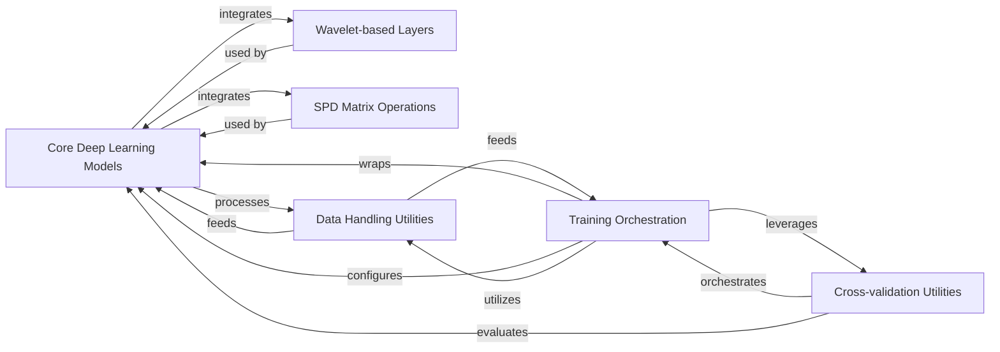

## Details

The Core Deep Learning Models component is central to the project, defining the primary neural network architectures and their PyTorch Lightning wrappers for training and evaluation. This component integrates specialized layers from Wavelet-based Layers and SPD Matrix Operations to process neurophysiological data effectively.

### Core Deep Learning Models [[Expand]](./Core_Deep_Learning_Models.md)

Defines the primary neural network architectures (Green, GreenG2) and their PyTorch Lightning wrappers (GreenRegressorLM, GreenClassifierLM) for training and evaluation.

**Related Classes/Methods**:

- `GreenRegressorLM` (1:1)

- `GreenClassifierLM` (1:1)

- `get_green` (1:1)

- `get_green_g2` (1:1)

- `vectorize_upper` (1:1)

- `vectorize_upper_one` (1:1)

- `Green` (1:1)

- `GreenG2` (1:1)

### Wavelet-based Layers

Provides specialized neural network layers that incorporate wavelet transformations or related signal processing techniques (e.g., RealCovariance, WaveletConv).

**Related Classes/Methods**:

- `RealCovariance` (1:1)

- `WaveletConv` (1:1)

### SPD Matrix Operations

Offers specialized layers and operations for Symmetric Positive Definite (SPD) matrices (e.g., Shrinkage, BiMap, LogMap).

**Related Classes/Methods**:

- `Shrinkage` (1:1)

- `BiMap` (1:1)

- `LogMap` (1:1)

### Training Orchestration

Manages the PyTorch Lightning-specific logic for training, validation, and testing. It defines the LightningModule classes that wrap the core models, handles loss calculation, optimization, and the overall training loop.

**Related Classes/Methods**:

- `GreenRegressorLM` (1:1)

- `GreenClassifierLM` (1:1)

### Data Handling Utilities

Provides functions and classes for loading, preprocessing, and preparing neurophysiological data for input into the deep learning models.

**Related Classes/Methods**: _None_

### Cross-validation Utilities

Contains functions and logic for performing cross-validation experiments, which are critical for robust model evaluation and hyperparameter tuning in research.

**Related Classes/Methods**: _None_

### [FAQ](https://github.com/CodeBoarding/GeneratedOnBoardings/tree/main?tab=readme-ov-file#faq)