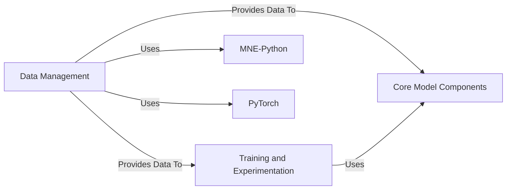

## Details

This project's architecture is built upon five fundamental components: Data Management, Training and Experimentation, Core Model Components, MNE-Python, and PyTorch. These components ensure robust data handling, systematic model training, and define the core neural network architectures, leveraging specialized tools for neurophysiological data and the PyTorch framework.

### Data Management [[Expand]](./Data_Management.md)

This component is responsible for the entire data pipeline, including loading, preprocessing, and preparing neurophysiological data (e.g., EEG/MEG epochs) into a format suitable for deep learning models. It encapsulates dataset creation and any necessary data transformations. Specifically, it implements a PyTorch Dataset to handle the sampling, padding, shuffling, and on-the-fly transformations of epoch data and their corresponding targets, making it ready for use with PyTorch DataLoaders.

**Related Classes/Methods**:

- `EpochsDataset` (1:1)

### Training and Experimentation

This component orchestrates the training and evaluation of deep learning models. It utilizes PyTorch Lightning for streamlined training loops, callbacks, and experiment management. It consumes prepared data from the Data Management component.

**Related Classes/Methods**:

- `Trainer` (1:1)

- `LightningModule` (1:1)

### Core Model Components

This component houses the deep learning models, layers, and modules. These models are designed to process the preprocessed neurophysiological data provided by the Data Management component.

**Related Classes/Methods**:

- `SPD layers` (1:1)

- `wavelet layers` (1:1)

### MNE-Python

A fundamental external library used for reading, analyzing, and visualizing MEG and EEG data. The Data Management component heavily relies on MNE for initial data loading and epoching.

**Related Classes/Methods**:

### PyTorch

The primary deep learning framework used for building and training models. The Data Management component provides data in a PyTorch-compatible format (torch.Tensor), and the Training and Experimentation and Core Model Components are built upon PyTorch.

**Related Classes/Methods**:

### [FAQ](https://github.com/CodeBoarding/GeneratedOnBoardings/tree/main?tab=readme-ov-file#faq)