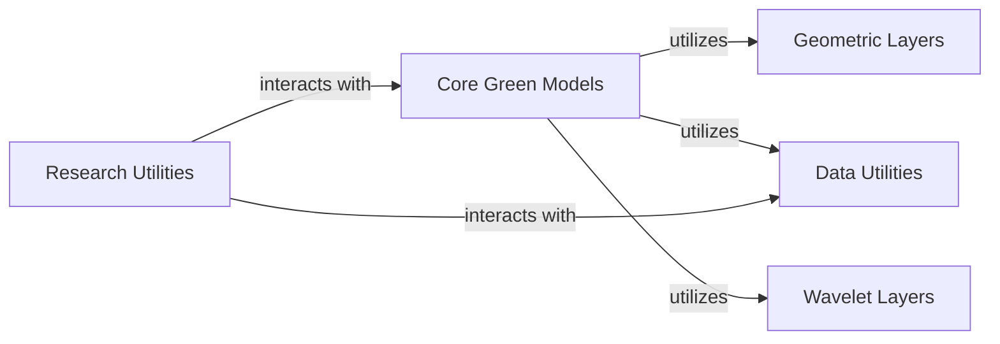

## Details

Deep Learning Research Library/Framework

### Geometric Layers [[Expand]](./Geometric_Layers.md)

This component implements specialized neural network layers and operations designed to process Symmetric Positive Definite (SPD) matrices. It leverages geometric deep learning principles to handle covariance matrices or other SPD-valued data directly within the neural network architecture, enabling the model to operate on the Riemannian manifold of SPD matrices.

**Related Classes/Methods**:

- <a href="https://github.com/Roche/neuro-green/blob/main/green/spd_layers.py#L1-L100" target="_blank" rel="noopener noreferrer">`green.spd_layers` (1:100)</a>

### Core Green Models

This component encompasses the primary deep learning models that utilize the `Geometric Layers` for processing Symmetric Positive Definite (SPD) data. These models are likely built using PyTorch Lightning for structured training and experimentation.

**Related Classes/Methods**:

- <a href="https://github.com/Roche/neuro-green/blob/main/green/research_code/pl_utils.py#L1-L100" target="_blank" rel="noopener noreferrer">`green.research_code.pl_utils` (1:100)</a>

### Data Utilities

This component provides utility functions and classes for handling and preparing data, likely including transformations, loading, and preprocessing steps necessary for the `Core Green Models` to consume.

**Related Classes/Methods**:

- <a href="https://github.com/Roche/neuro-green/blob/main/green/data_utils.py#L1-L100" target="_blank" rel="noopener noreferrer">`green.data_utils` (1:100)</a>

### Wavelet Layers [[Expand]](./Wavelet_Layers.md)

This component likely implements neural network layers or operations that incorporate wavelet transforms, potentially for feature extraction or signal processing within the deep learning models.

**Related Classes/Methods**:

- <a href="https://github.com/Roche/neuro-green/blob/main/green/wavelet_layers.py#L1-L100" target="_blank" rel="noopener noreferrer">`green.wavelet_layers` (1:100)</a>

### Research Utilities

This component contains various utility functions and scripts specifically designed to support research activities, such as cross-validation, example notebooks, and general PyTorch Lightning utilities for experimental setups.

**Related Classes/Methods**:

- <a href="https://github.com/Roche/neuro-green/blob/main/green/research_code/crossval_utils.py#L1-L100" target="_blank" rel="noopener noreferrer">`green.research_code.crossval_utils` (1:100)</a>

- `green.research_code.example` (1:100)

- `green.research_code.example_wo_wav` (1:100)

- <a href="https://github.com/Roche/neuro-green/blob/main/green/research_code/pl_utils.py#L1-L100" target="_blank" rel="noopener noreferrer">`green.research_code.pl_utils` (1:100)</a>

### [FAQ](https://github.com/CodeBoarding/GeneratedOnBoardings/tree/main?tab=readme-ov-file#faq)