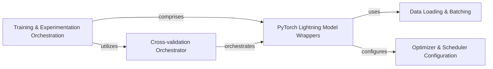

## Details

One paragraph explaining the functionality which is represented by this graph. What the main flow is and what is its purpose.

### Training & Experimentation Orchestration

This is the overarching component that defines and manages the high-level strategy and execution flow for all deep learning experiments. It coordinates the use of PyTorch Lightning for structured training and integrates cross-validation methodologies to ensure robust model evaluation.

**Related Classes/Methods**:

- <a href="https://github.com/Roche/neuro-green/blob/main/green/research_code/crossval_utils.py#L114-L213" target="_blank" rel="noopener noreferrer">`green.research_code.crossval_utils.pl_crossval` (114:213)</a>

- <a href="https://github.com/Roche/neuro-green/blob/main/green/research_code/pl_utils.py#L64-L164" target="_blank" rel="noopener noreferrer">`green.research_code.pl_utils.GreenRegressorLM` (64:164)</a>

- <a href="https://github.com/Roche/neuro-green/blob/main/green/research_code/pl_utils.py#L167-L310" target="_blank" rel="noopener noreferrer">`green.research_code.pl_utils.GreenClassifierLM` (167:310)</a>

### PyTorch Lightning Model Wrappers

These are specialized classes (`GreenRegressorLM`, `GreenClassifierLM`) within `pl_utils.py` that extend PyTorch Lightning's `LightningModule`. They encapsulate the core training, validation, testing, and prediction logic for the underlying deep learning models, handling loss computation, metric logging, and integration with PyTorch Lightning's training loop.

**Related Classes/Methods**:

- <a href="https://github.com/Roche/neuro-green/blob/main/green/research_code/pl_utils.py#L64-L164" target="_blank" rel="noopener noreferrer">`green.research_code.pl_utils.GreenRegressorLM` (64:164)</a>

- <a href="https://github.com/Roche/neuro-green/blob/main/green/research_code/pl_utils.py#L167-L310" target="_blank" rel="noopener noreferrer">`green.research_code.pl_utils.GreenClassifierLM` (167:310)</a>

### Cross-validation Orchestrator

This module (`crossval_utils.py`) provides utilities for setting up and executing cross-validation experiments. It manages the splitting of datasets into different folds and orchestrates the training and evaluation of models across these folds, which is crucial for obtaining reliable and generalizable performance estimates.

**Related Classes/Methods**:

- <a href="https://github.com/Roche/neuro-green/blob/main/green/research_code/crossval_utils.py#L114-L213" target="_blank" rel="noopener noreferrer">`green.research_code.crossval_utils.pl_crossval` (114:213)</a>

- <a href="https://github.com/Roche/neuro-green/blob/main/green/research_code/crossval_utils.py#L23-L111" target="_blank" rel="noopener noreferrer">`green.research_code.crossval_utils.run_one_fold_pl` (23:111)</a>

### Data Loading & Batching

This component, primarily through the `get_train_test_loaders` function in `pl_utils.py`, is responsible for preparing and loading data into `DataLoader` objects. It handles dataset subsetting based on training and testing indices, and configures efficient batch processing for feeding data to the models during training and evaluation.

**Related Classes/Methods**:

- <a href="https://github.com/Roche/neuro-green/blob/main/green/research_code/pl_utils.py#L26-L61" target="_blank" rel="noopener noreferrer">`green.research_code.pl_utils.get_train_test_loaders` (26:61)</a>

### Optimizer & Scheduler Configuration

Managed within the `configure_optimizers` method of the PyTorch Lightning Model Wrappers, this component handles the setup of optimization algorithms (e.g., Adam) and learning rate schedulers (e.g., `ReduceLROnPlateau`). It allows for flexible learning rate policies, including differentiated rates for specific parameter groups (e.g., wavelet layers).

**Related Classes/Methods**:

- <a href="https://github.com/Roche/neuro-green/blob/main/green/research_code/pl_utils.py#L131-L159" target="_blank" rel="noopener noreferrer">`green.research_code.pl_utils.GreenRegressorLM.configure_optimizers` (131:159)</a>

- <a href="https://github.com/Roche/neuro-green/blob/main/green/research_code/pl_utils.py#L277-L305" target="_blank" rel="noopener noreferrer">`green.research_code.pl_utils.GreenClassifierLM.configure_optimizers` (277:305)</a>

### [FAQ](https://github.com/CodeBoarding/GeneratedOnBoardings/tree/main?tab=readme-ov-file#faq)