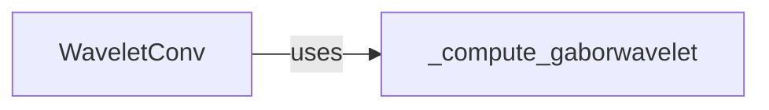

## Details

The `Wavelet Layers` component is fundamental to the `neuro-green` project, providing specialized neural network layers for advanced time-frequency analysis of neurophysiological signals. It adheres to the "Deep Learning Research Library/Framework" architectural pattern by offering modular, reusable, and learnable components for signal processing within deep learning models.

### WaveletConv

This is a custom PyTorch `nn.Module` that implements a learnable Gabor wavelet convolution layer. It dynamically generates and applies Gabor wavelets to input signals, allowing the model to learn optimal frequency and bandwidth parameters for feature extraction. It handles both single and multiple epoch inputs, performing 1D convolution with the generated wavelets.

**Related Classes/Methods**:

- `WaveletConv`

### _compute_gaborwavelet

A utility function responsible for the mathematical computation of the Gabor wavelet filterbank. It takes parameters such as time vector, center frequencies (`foi`), full-width at half-maximums (`fwhm`), sampling frequency, and scaling, and returns a set of complex Gabor wavelets. This function encapsulates the core mathematical logic for wavelet generation.

**Related Classes/Methods**:

- `_compute_gaborwavelet`

### [FAQ](https://github.com/CodeBoarding/GeneratedOnBoardings/tree/main?tab=readme-ov-file#faq)