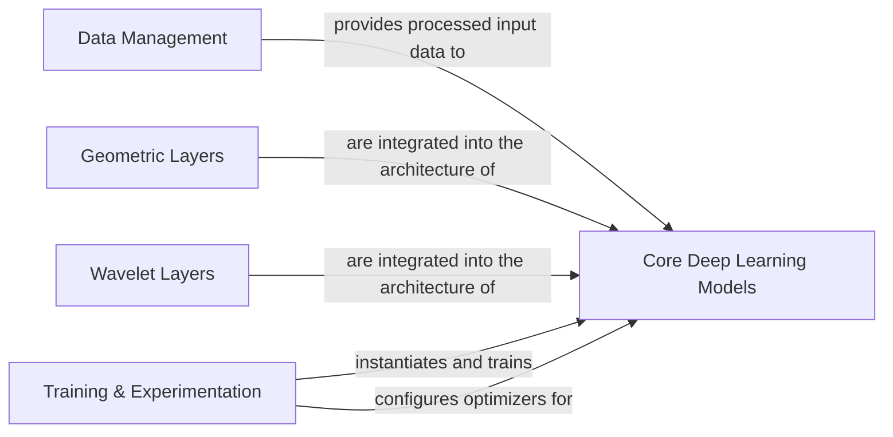

## Details

The `neuro-green` project is structured as a modular Deep Learning Research Library/Framework, focusing on computational neuroscience applications. Its architecture emphasizes clear separation of concerns for data handling, specialized neural network layers, core model definitions, and training orchestration.

### Data Management [[Expand]](./Data_Management.md)

This component is responsible for the entire data pipeline, including loading, preprocessing, and preparing neurophysiological data (e.g., EEG/MEG epochs) into a format suitable for deep learning models. It encapsulates dataset creation and any necessary data transformations.

**Related Classes/Methods**:

- <a href="https://github.com/Roche/neuro-green/blob/main/green/data_utils.py#L1-L1000" target="_blank" rel="noopener noreferrer">`green.data_utils` (1:1000)</a>

### Geometric Layers [[Expand]](./Geometric_Layers.md)

This component implements specialized neural network layers and operations that operate on Symmetric Positive Definite (SPD) matrices. It leverages geometric deep learning principles to handle covariance matrices or other SPD-valued data within the neural network architecture.

**Related Classes/Methods**:

- <a href="https://github.com/Roche/neuro-green/blob/main/green/spd_layers.py#L1-L1000" target="_blank" rel="noopener noreferrer">`green.spd_layers` (1:1000)</a>

### Wavelet Layers [[Expand]](./Wavelet_Layers.md)

This component provides custom neural network layers for extracting time-frequency features using wavelet transforms, specifically Gabor wavelets. These layers are crucial for time-frequency analysis of neurophysiological signals within the deep learning models.

**Related Classes/Methods**:

- <a href="https://github.com/Roche/neuro-green/blob/main/green/wavelet_layers.py#L1-L1000" target="_blank" rel="noopener noreferrer">`green.wavelet_layers` (1:1000)</a>

### Core Deep Learning Models [[Expand]](./Core_Deep_Learning_Models.md)

This central component defines the main deep learning architectures (`Green`, `GreenG2`, `GreenRegressorLM`, `GreenClassifierLM`) built using PyTorch Lightning. These models integrate the specialized `Geometric Layers` and `Wavelet Layers` to perform specific tasks (e.g., regression, classification) on neurophysiological data. It also includes auxiliary functions directly supporting model operations.

**Related Classes/Methods**:

- <a href="https://github.com/Roche/neuro-green/blob/main/green/research_code/pl_utils.py#L1-L1000" target="_blank" rel="noopener noreferrer">`green.research_code.pl_utils` (1:1000)</a>

### Training & Experimentation [[Expand]](./Training_Experimentation.md)

This component manages the entire training and experimentation lifecycle of the deep learning models. It handles aspects such as cross-validation setups, optimizer configuration, and the overall execution flow for model training and evaluation using PyTorch Lightning.

**Related Classes/Methods**:

- <a href="https://github.com/Roche/neuro-green/blob/main/green/research_code/crossval_utils.py#L1-L1000" target="_blank" rel="noopener noreferrer">`green.research_code.crossval_utils` (1:1000)</a>

- <a href="https://github.com/Roche/neuro-green/blob/main/green/research_code/pl_utils.py#L1-L1000" target="_blank" rel="noopener noreferrer">`green.research_code.pl_utils` (1:1000)</a>

### [FAQ](https://github.com/CodeBoarding/GeneratedOnBoardings/tree/main?tab=readme-ov-file#faq)